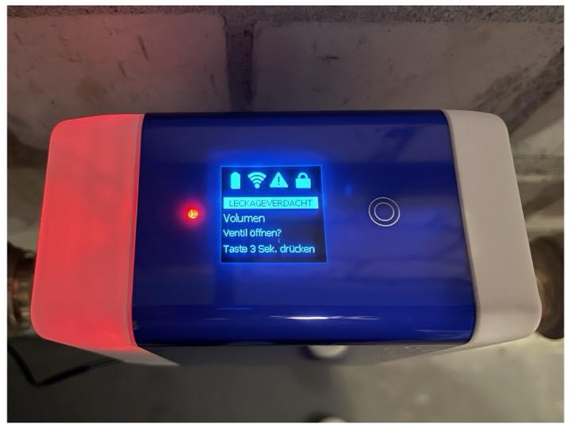
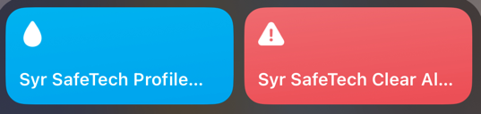
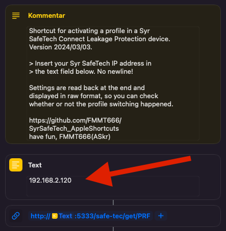

Syr SafeTech Apple Shortcuts
============================

Handy [Apple Shortcuts][3] for the [Syr SafeTech Connect][1] leakage protection.

Switch profiles or reset alarm directly from your phone, 20 times faster than this Syr App disaster.

  

,( °-°)/'Now that's huge. 

Also lookout for a Python based logger & control app [right here][2].

---
## Requirements

  - An iOS or macOS device with [Apple Shortcuts][3] installed.
  - A local or VPN connection to the network the Syr is in.  
    Notice that is is _not_ a "cloud communication".

Upon activating any of the shortcuts for the first time, you need to enter the IP address of your
Syr SafeTech Connect. Do only enter the IP address, without any newline or other characters.

The IP address needs to be in the 1st text field, right after the comment section:

---
## Syr Profile Changer

This shortcut reads the name and number of the currently activated profile and displays it.  
You can either stop at this point or continue to select the profile which should be activated.

All available profiles are read and displayed in a list. The more profiles your Syr has (max eight),
the longer this step takes.

The response to the change profile command is presented in raw format, for clarity. After that, the
active profile is again read out and displayed.

Example 1:

https://github.com/FMMT666/SyrSafeTech_AppleShortcuts/assets/3057791/0191dca0-d029-4da3-8d65-86593a3e40f0

Example 2:

https://github.com/FMMT666/SyrSafeTech_AppleShortcuts/assets/3057791/1e3628d0-32ea-4405-bedf-07ba10949021

Download: [Syr SafeTech Profile Control](https://www.icloud.com/shortcuts/b41bf533de4a477785dd626bb2524bc8)

---
## Syr Reset Alarm

This shortcat can clear an alarm. It will also automatically open the valve.  
Usually needed when you (again) forgot to disable the "absent profile" and used too much water.

It reads out and displays the alarm condition. In case of an alarm, you either can abort the shortcut
here, or proceed to clear the alarm and open the valve.

> Except for the first message box dialog ["CLEAR ALARM AND OPEN VALVE?"], it is _not_ recommended to
> cancel any of the next two dialog boxes, as this might not clear the "admin mode" (required to reset the alarm).

Nothing dramatic, but keeping the Syr in admin mode is not that nice.

I will change the dialog options in the next release (if I manage to find an option in Apple Shortcuts).

Example 1, no alarm occured:

https://github.com/FMMT666/SyrSafeTech_AppleShortcuts/assets/3057791/22afa332-270e-4cb8-99f7-15c8a9af4690

Example 2, clear alarm and change profile afterwards.  
This would take several minutes with the Syr App!

https://github.com/FMMT666/SyrSafeTech_AppleShortcuts/assets/3057791/ebff0219-8865-415f-bbbc-7b92ffb44d6d

Download: [Syr SafeTech Clear Alarm](https://www.icloud.com/shortcuts/a3487932606840a5b388c7f705d452f7)

---
## NEWS

### CHANGES 2024/03/XX:
    - initial commit of profile change Shortcut
    - initial commit of alarm reset Shortcut
    - decided to use the iCloud links instead of local links
    - testing video link in the readme
    - added some videos, bc why not
    - added seom descriptions

---
## TODO
    - docs
    - close valve Shortcut
    - yet faster version which does not read out the profiles, but just activates one;
      would take only about 2s then

---
Have a nice day  
FMMT666(ASkr)

---
[1]: https://www.syr.de/en/Products/CB9D9A72-BC51-40CE-840E-73401981A519/SafeTech-Connect
[2]: https://github.com/FMMT666/SyrSafeTechLogger
[3]: https://support.apple.com/en-gb/guide/shortcuts/welcome/ios

